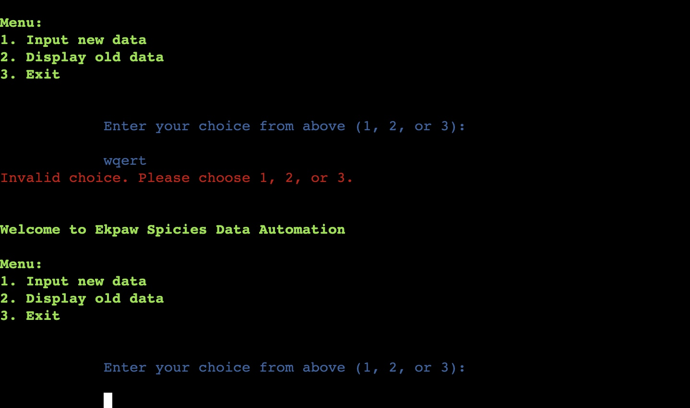

# Welcome to Ekpaw Spicies Data Automation

[Link to Ekpaw Spicies Data Automation](https://ekpaw-spicies-e70a831cb30f.herokuapp.com/)

This is an a data automation to calculate profit or loss in each market day given
the total quantity of goods sold. The goods here are four different spicies sold in
kilograms. The spicies are garlic, leek , onion, and okra.

## Features:
The user must enter a choice in the menu section where there are three options as follows:
- To input new data.
- To display existing data.
- To exit.
* if user enters a wrong number, a wrong message will appear. Appearance of menu page is shown below:

### To input new data choice:
1. Requesting input:
The user must enter the sales data for the four spicies one after the other. The value must be a positive integer
between 0 and 99. There is a while loop for each input and another while loop for when all inputs are collected.
* if user enters a wrong number, a wrong message will appear. Appearance of input page is shown below:

 
- After the requested sales data is collected, it is then validated and match the sales data into the correct formate in
the worksheet, and update the sales worksheet with sales data. 
- Thereafter, the cost prices and sales prices in worksheet is matched with sales data to calculate the total cost and total revenue of each spicies and updated to worksheet.
- The profit/loss is then calculated from total revenue and total cost for each spices and updated to worksheet.
- The sum of total profit/loss, sum of total cost, and sum of total revenue of spicies in the last market day is parse to
to be viewed by the user. The photo is show below:

2. The program then returns to menu options:
* if user enters a wrong value, a wrong message will appear. Same as in input new data choice.

### To display existing data choice:
1. Display of data:
Here, The sum of total profit/loss, sum of total cost, and sum of total revenue of spicies in the last market day 
is displayed to the user. The data from the worksheet is also displayed in a table formate. This table data includes,
sales data, total cost, total revenue and profit/loss data. The display is same as the photo above.

2. The program then returns to menu options:
* if user enters a wrong value, a wrong message will appear. Same as in input new data choice.

### Exit
Here, the program shows that it has been teminated by showing program existed by inputing 3.
* if user enters a wrong value, a wrong message will appear. Same as in input new data choice.
The photo is shown below:

### Wrong message for entering wrong data:
1. Menu:
The examples of wrong messages under menu options is shown below:

2. Input new data:
The examples of wrong messages under input new data is shown below:

## Future plan
* More calculations can be made from the sales data in respect to averages, totals, stock and so on for
better business decisions.

## Lucidchart

 The lucidchart represents the logic of the application:

  

## Technologies Used

### Languages:

 - Python used to anchor the project and direct all application behavior

### Frameworks/Libraries, Programmes and Tools:
#### Python modules/packages:

#### Library imports:

- Gspread used for reading, writing, and formatting cell ranges in googlesheets.
- Google-auth
- Numpy
- Tabulate was used to create well-formatted tables.
- Colorama was used to add colors and styles to the project.

#### Other tools:

- Gitpod was used as the main tool to write and edit code.
- Git was used for the version control of the website.
- GitHub was used to host the code of the website.
- Lucidchart was used to make a lucidchart for the README file.
- Heroku was used to deploy my project.

## Bugs 

- While coding, I encountered a bug, when there is no existing data to display,
upon pressing 2 in menu to display current data, the program fails. Seen below:

* Solution: Solve this by introducing try and except statement in the display data function.
The photo is shown below:

 

- Function to input data for each spicies will return to the first function each time an error
occured at any level while entering data.

* Solution: I introduced a while loop for each spiceis input given that there was already a while loop
for the function that collects all the four enteries.

## Unsolved bugs

* None.

## Testing

* All clear, no errors found when passing through [CI Python Linter](https://pep8ci.herokuapp.com/#).

Photo of test start and end of page below:

## Deployment

* The program was deployed to [Heroku](https://dashboard.heroku.com/).
* The program can be reached by the [link](https://ekpaw-spicies-e70a831cb30f.herokuapp.com/)

### To deploy the project to Heroku so it can be run as a remote web application

- Create a Heroku account if you don't already have one here [Heroku](https://dashboard.heroku.com/).

- Create a new Heroku application on the following page here New [Heroku App](https://dashboard.heroku.com/apps):

- Go to the Deploy tab

- Link your GitHub account and connect the application to the repository you created.

- Go to the Settings tab

- Click "Add buildpack"

- Add the Python and Node.js buildpacks in the following order

- Click Reveal Config Vars

- Add 2 Config vars

- Key: CREDS    Value: past creds.json content

- Key: PORT    Value: 8000

- Click manual Deploy Branch

- Click View to launch the application inside a web page.

## Credits

I got some help from the Love sandwiches project and course content.

## Acknowledgements

- [Code Institute](https://codeinstitute.net/) tutors and Mentor:Iuliia Konovalova, for their continues support.